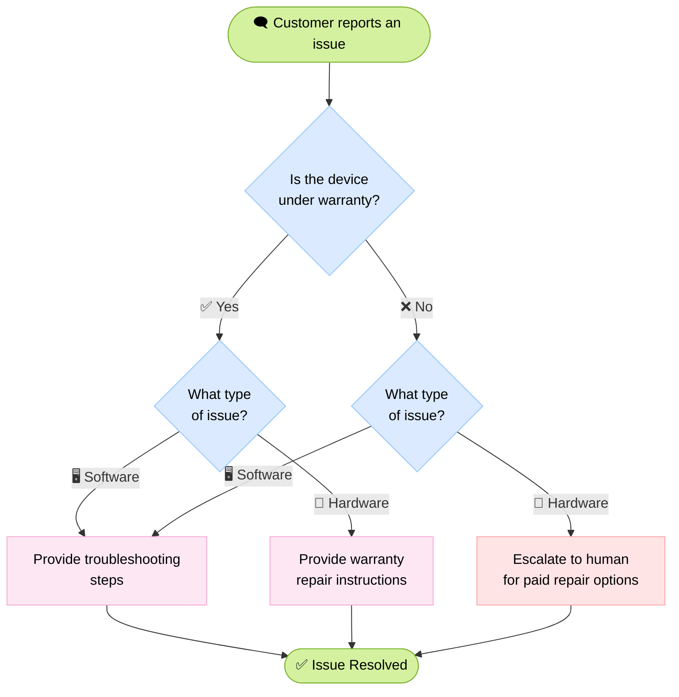

# Product Warranty Support Agent

A multi-step customer support agent that handles device warranty claims using LangChain and LangGraph.

## Workflow



## How It Works

The agent progresses through three steps driven by middleware and tool calls:

| Step | Role | Tools |
|---|---|---|
| `warranty_collector` | Greet customer, ask about warranty | `record_warranty_status` |
| `issue_classifier` | Ask customer to describe the issue | `record_issue_type` |
| `resolution_specialist` | Provide solution or escalate | `provide_solution`, `escalate_to_human` |

Each tool returns a LangGraph `Command` that updates state and advances `currentStep`. The middleware in [middleware.ts](middleware.ts) reads `currentStep` each turn to inject the right system prompt and tools.

## File Structure

```
product-warranty/
├── index.ts        # Runs a 4-turn demo conversation
├── middleware.ts   # Swaps prompt + tools per step
├── state.ts        # LangGraph state (currentStep, warrantyStatus, issueType)
├── schemas.ts      # Zod enums for steps, warranty status, issue type
├── tools.ts        # Tools that record state and drive transitions
└── prompts.ts      # System prompts for each step
```

## Running

```bash
pnpm tsx product-warranty/
```

## Example Output

```bash
=== Turn 1: Warranty Collection ===
Hi, my phone screen is cracked
Hello! I'm sorry to hear that your phone screen is cracked. Let's see if your device is still under warranty. Could you please confirm whether your device is in warranty?

=== Turn 2: Warranty Response ===
Yes, it's still under warranty

Warranty status recorded as: in_warranty
Thank you for confirming that your device is under warranty. Since your issue is a cracked screen, this is classified as a hardware issue.

I'll go ahead and record this classification for you. One moment, please.
Issue type recorded as: hardware

Solution provided: Since your device is under warranty, you can proceed with the warranty repair process. Please visit your device manufacturer's service center or website to initiate a warranty claim for your cracked screen.
Current step: resolution_specialist

=== Turn 3: Issue Description ===
The screen is physically cracked from dropping it
Thank you for the additional information. I'll escalate this case for further assistance regarding your options for repair.
Escalating to human support. Reason: The customer reported a cracked screen due to dropping the device, which may not be covered under warranty.
Current step: resolution_specialist

=== Turn 4: Resolution ===
What should I do?
Please wait for a human support specialist to reach out to you regarding your repair options.
```
