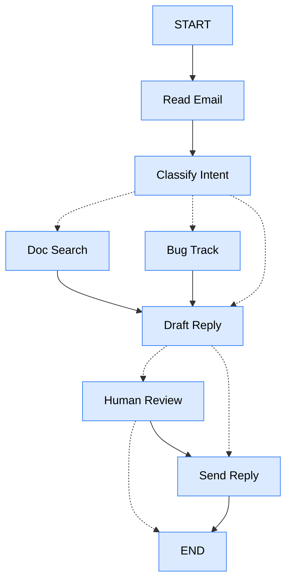

# Read & Reply Email Agent

A LangGraph agent that triages an incoming customer email, gathers supporting context, drafts a reply with an LLM, and pauses for human approval before sending anything sensitive.

## Workflow



## How It Works

1. **readEmail** — placeholder for pulling the raw email from your email service.
2. **classifyIntent** — runs the email through `llm.withStructuredOutput(EmailClassificationSchema)` to get `intent`, `urgency`, `topic`, and `summary`, then routes with a `Command`:
   - `question` / `feature` → `searchDocumentation`
   - `bug` → `bugTracking`
   - everything else (including `billing`) → `draftResponse`
3. **searchDocumentation** / **bugTracking** — gather context (docs snippets or a bug ticket ID) and always forward to `draftResponse`. `searchDocumentation` has a retry policy (`maxAttempts: 3`) since lookups can fail transiently.
4. **draftResponse** — generates the reply text with the LLM, then decides whether it needs a human in the loop: `urgency` is `high`/`critical`, `intent` is `complex`, or `intent` is `billing`. Routes to `humanReview` or straight to `sendReply`.
5. **humanReview** — calls `interrupt()`, which pauses the graph and returns control to the caller (nothing after it runs until the graph is resumed). Resuming with `approved: true` continues to `sendReply` (optionally overwriting the draft with `editedResponse`); `approved: false` ends the graph without sending.
6. **sendReply** — placeholder for actually sending the email.

Because every node above uses a `Command` to pick its next node dynamically (instead of static `addEdge`s), each `addNode(...)` call in [index.ts](index.ts) declares its possible destinations via `ends: [...]`. LangGraph needs this to verify the graph is fully reachable at compile time — omitting it raises `UnreachableNodeError`.

### Pausing and resuming

The graph is compiled with a `MemorySaver` checkpointer, keyed by `thread_id` in `config`. When `humanReview` calls `interrupt()`, `app.invoke(...)` returns immediately with the interrupt payload attached — check for it with `isInterrupted(result)` and read it off `result[INTERRUPT]`. To continue, call `app.invoke(new Command({ resume: {...} }), config)` with the **same** `thread_id`; LangGraph replays from the checkpoint and feeds your resume value back as `humanReview`'s `interrupt()` return value. [index.ts](index.ts) loops on this until the graph stops interrupting.

## Nodes

| Node | Role | Routes to |
|---|---|---|
| `readEmail` | Fetch/parse the raw email | `classifyIntent` |
| `classifyIntent` | LLM-classify intent, urgency, topic | `searchDocumentation`, `bugTracking`, `draftResponse` |
| `searchDocumentation` | Look up relevant docs (retries on failure) | `draftResponse` |
| `bugTracking` | File/reference a bug ticket | `draftResponse` |
| `draftResponse` | Draft the reply, decide if review is needed | `humanReview`, `sendReply` |
| `humanReview` | Interrupt for human approval/edit | `sendReply`, `END` |
| `sendReply` | Send the final reply | `END` |

## File Structure

```
read-and-reply-email/
├── index.ts    # Graph definition, compile + checkpointer, invoke/resume loop
├── nodes.ts    # Node implementations (classification, drafting, human review, etc.)
├── state.ts    # StateSchema + EmailClassificationSchema (zod)
└── types.ts    # EmailAgentStateType (initial input shape)
```

If the classification triggers human review, you'll be prompted in the terminal to approve (`y`/`n`) and optionally edit the draft before it's "sent".

To try a different email, edit the `emailContent` field in [index.ts:54](index.ts#L54).

## Output
```
Processing email: How do I reset my password?
Sending reply: Subject: Password Reset Instructions

Dear [Customer's Name],

Thank you for reaching out to us! I’m happy to assist you with resetting your password.

To reset your password, please follow these steps:

1. Go to the **Settings** section of your account.
2. Navigate to **Security**.
3. Select **Change Password**.

When creating a new password, please ensure it meets the following criteria:
- At least 12 characters long
- Includes a mix of uppercase and lowercase letters
- Contains numbers and symbols

If you have any further questions or need additional assistance, feel free to reach out. 

Best regards,

[Your Name]  
[Your Position]  
[Your Company]  
[Your Contact Information]
```
