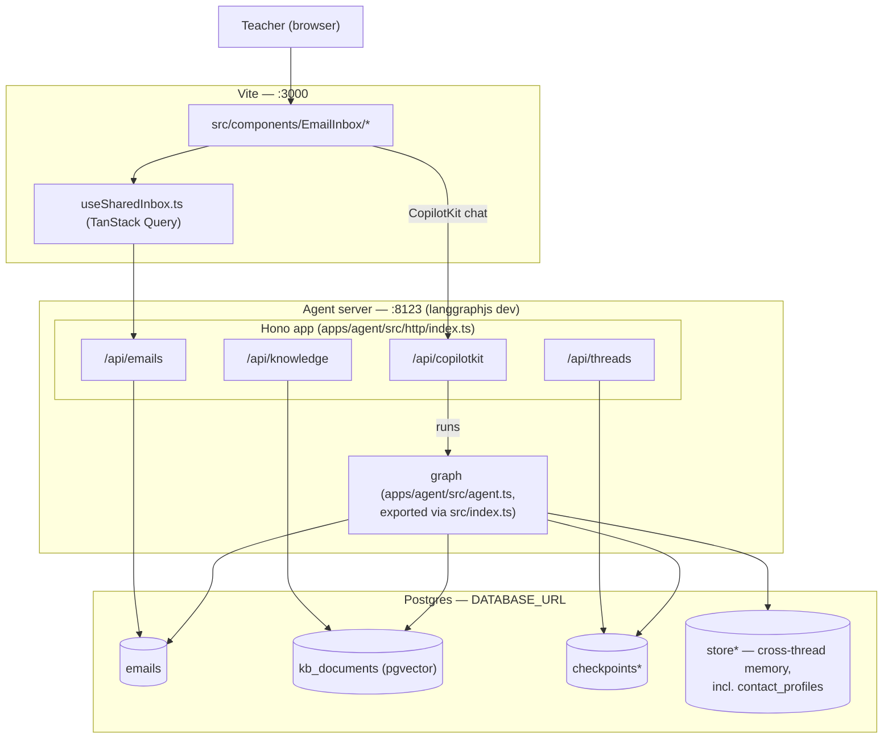
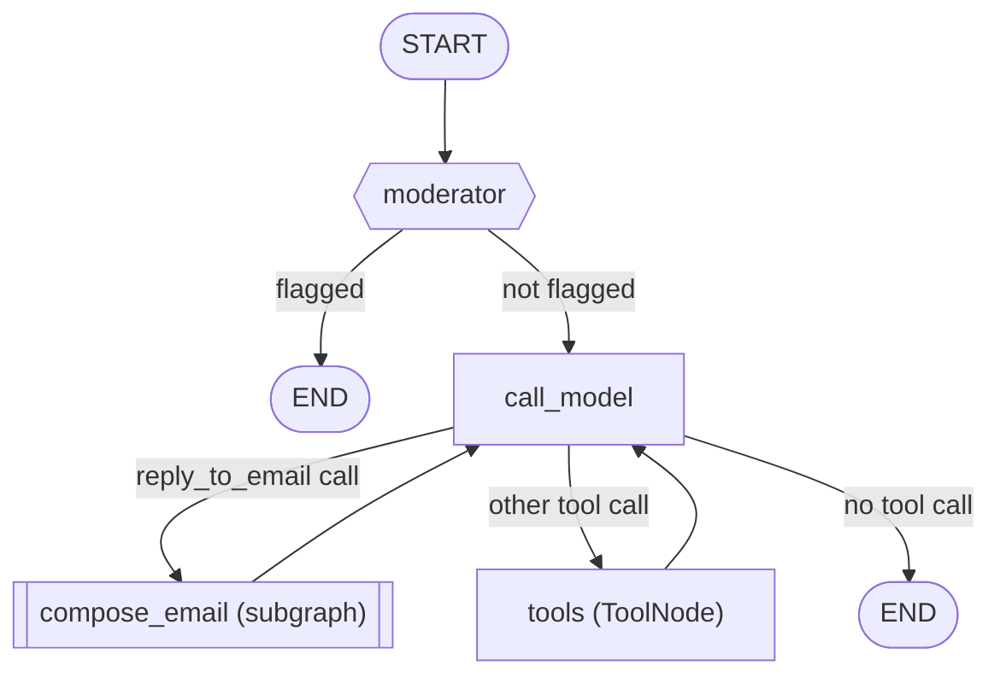
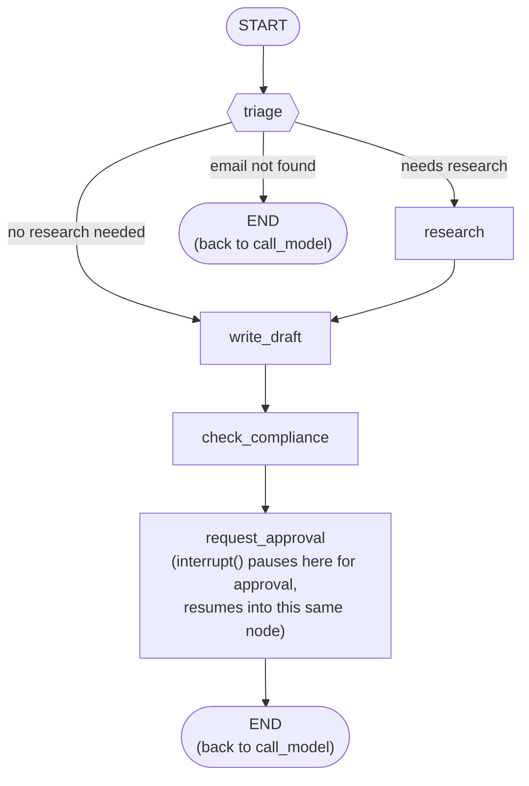
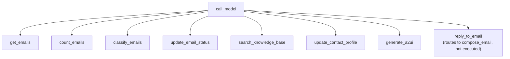
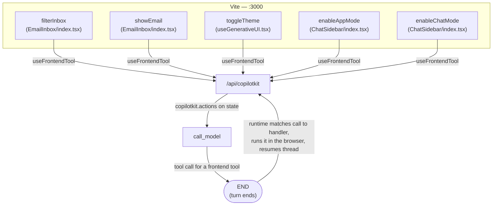

# Architecture

Diagrams of the AI Email Assistant, ordered by zoom level — start at the system, then drop into
each piece it's made of:

1. **System overview** — browser, agent server, Postgres, and how they talk to each other.
2. **Main agent graph** — what runs inside "the agent server" box above.
3. **`compose_email` subgraph** — what runs inside that graph's `compose_email` node.
4. **Tools available to `call_model`** — what's inside that graph's `tools` node.
5. **Frontend tools** — a separate mechanism, tools the model can call that run in the browser
   instead of node 4's `ToolNode`.

## System overview

`apps/agent/langgraph.json` also registers a second, debug-only graph, `compose_email_debug`,
pointing straight at `composeEmailSubgraph.ts` — useful for exercising that subgraph in isolation
via LangGraph Studio, not part of the request flow above.

## Main agent graph (`apps/agent/src/graphs/index.ts`)

Built by that file's `buildGraph`; the compiled `graph` symbol registered in `langgraph.json` as
`inbox_assistant` actually lives in `apps/agent/src/agent.ts`, re-exported via `src/index.ts`.

`moderator` is distinct from `call_model`'s own `SCOPE_GUIDE` (declines out-of-scope-but-safe
requests) and `check_compliance` below (checks outgoing drafts, not chat input). `tools` is
expanded in [Tools available to `call_model`](#tools-available-to-call_model); `compose_email`
in [the next section](#compose_email-subgraph-appsagentsrcgraphscomposeemailsubgraphts).

## `compose_email` subgraph (`apps/agent/src/graphs/composeEmailSubgraph.ts`)

Fixed prompt-chaining pipeline run for every reply — this is the `compose_email` node from the
[main agent graph](#main-agent-graph-appsagentsrcgraphsindexts) above. Every `END` below is this
subgraph's own end, not the run's — reaching it just returns control to the `compose_email` node
in the main graph, which then continues on to `call_model`, same as a function return.

## Tools available to `call_model`

`modelTools` (`apps/agent/src/tools/index.ts`); all but `reply_to_email` run through the `tools`
node — `reply_to_email` is routing-only and never executes. Frontend tools (below) are bound
in alongside these, so the model picks from one combined list.

## Frontend tools

UI components register these with `useFrontendTool` (`@copilotkit/react-core/v2`); `callModel`
(`apps/agent/src/nodes/index.ts`) binds them alongside `modelTools` for that invocation only.
They're deliberately left out of `executableTools`, so `routeAfterModel` never routes a call to
the `tools` node — that's what forces the turn to end instead.

