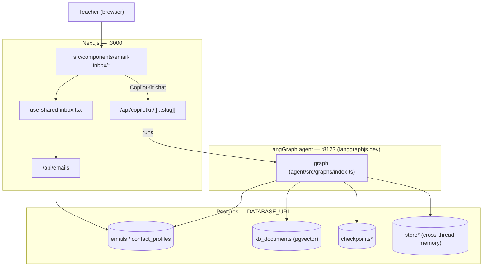
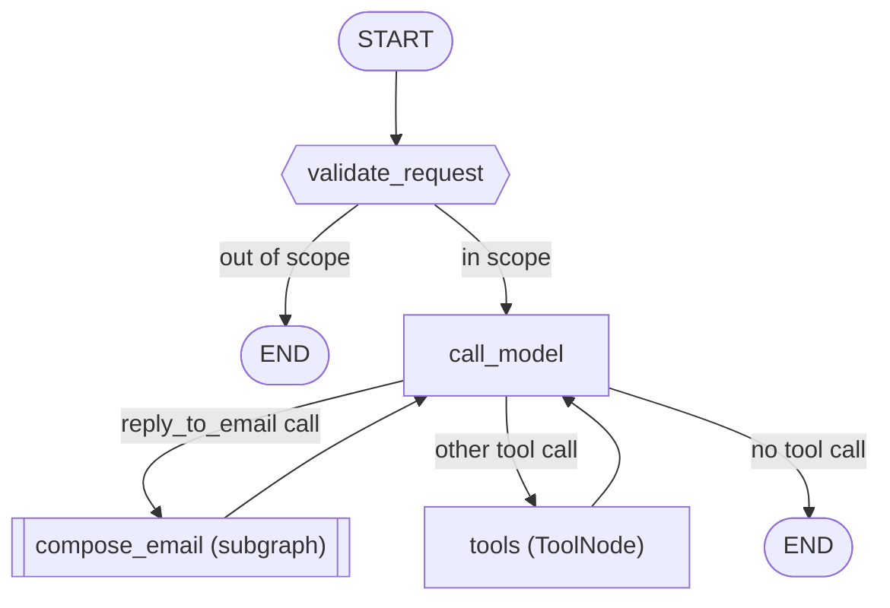
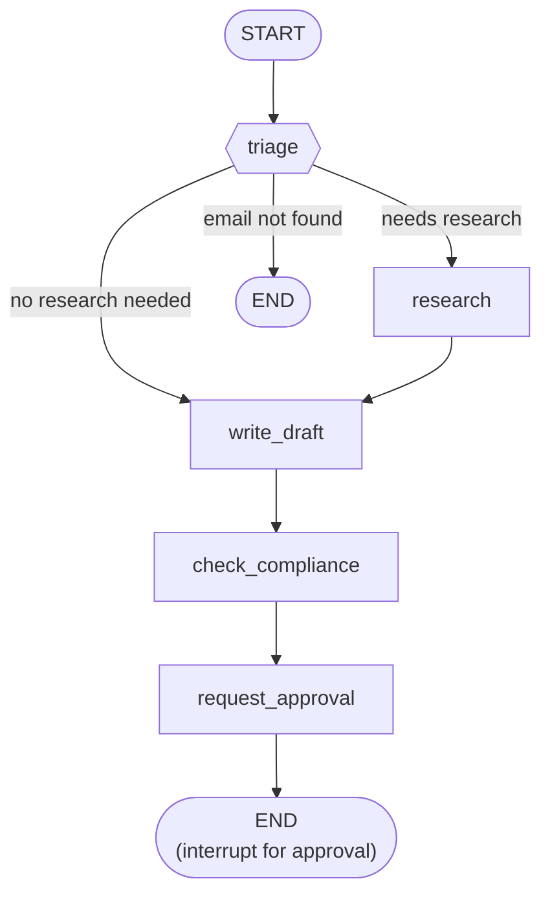
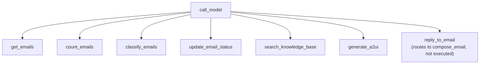

# Architecture

Diagrams of the AI Email Assistant: overall system, the main agent graph, and the
`compose_email` subgraph. All rendered top-to-bottom (vertical).

## System overview

## Main agent graph (`agent/src/graphs/index.ts`)

A ReAct loop; `compose_email` is a subgraph node (detailed below).

## `compose_email` subgraph (`agent/src/graphs/composeEmailSubgraph.ts`)

Fixed prompt-chaining pipeline run for every reply.

## Tools available to `call_model`

`modelTools` (`agent/src/tools/index.ts`); all but `reply_to_email` run through the `tools`
node — `reply_to_email` is routing-only and never executes.

