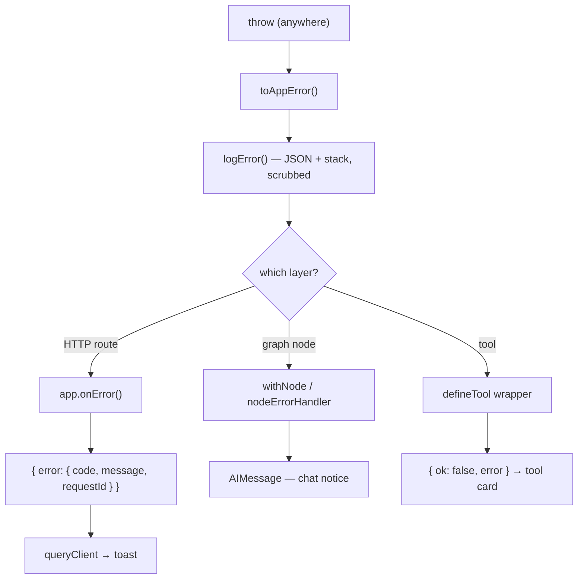

# Error handling

Centralized error handling + structured logging. One taxonomy, one handler per layer,
detailed JSON logs for developers, safe messages for the teacher.

## Principles

- **One catalog.** Every failure is an `ErrorCode` with fixed status, wording, and retry policy.
- **One handler per layer.** HTTP middleware, node wrapper, tool wrapper — no scattered `try/catch`.
- **Expected vs unexpected.** Expected errors explain themselves; unexpected ones return a generic line.
- **Nothing leaks.** Stack traces, pg messages, API keys, and connection strings stay in the log.
- **Correlate, don't guess.** Every HTTP failure carries a `requestId`; every agent failure a `threadId`.

## Where things live

| Concern                                                          | Location                                                                                                                   |
| ---------------------------------------------------------------- | -------------------------------------------------------------------------------------------------------------------------- |
| Codes                                                            | [errors/codes.ts](../apps/agent/src/errors/codes.ts)                                                                       |
| Catalog (status, wording, retry)                                 | [errors/catalog.ts](../apps/agent/src/errors/catalog.ts)                                                                   |
| `AppError`                                                       | [errors/AppError.ts](../apps/agent/src/errors/AppError.ts)                                                                 |
| `toAppError` — the only place foreign error shapes are inspected | [errors/normalize.ts](../apps/agent/src/errors/normalize.ts)                                                               |
| JSON logger                                                      | [logging/logger.ts](../apps/agent/src/logging/logger.ts)                                                                   |
| Secret/PII scrubbing                                             | [utils/redaction.ts](../apps/agent/src/utils/redaction.ts)                                                                 |
| HTTP middleware                                                  | [http/middleware/](../apps/agent/src/http/middleware/)                                                                     |
| Request schemas                                                  | [http/schemas.ts](../apps/agent/src/http/schemas.ts)                                                                       |
| Node wrapper + handler                                           | [nodes/withNode.ts](../apps/agent/src/nodes/withNode.ts), [nodes/errorHandler.ts](../apps/agent/src/nodes/errorHandler.ts) |
| Tool wrapper                                                     | [tools/defineTool.ts](../apps/agent/src/tools/defineTool.ts)                                                               |
| Web `ApiError` + logger                                          | [lib/errors.ts](../apps/web/src/lib/errors.ts), [lib/logger.ts](../apps/web/src/lib/logger.ts)                             |
| Web UI wording                                                   | [constants/errors.ts](../apps/web/src/constants/errors.ts)                                                                 |
| Toast                                                            | [stores/useToast.ts](../apps/web/src/stores/useToast.ts), [common/Toast/](../apps/web/src/components/common/Toast/)        |

## The catalog

`expected: false` → the user sees `GENERIC_MESSAGE`, never the real message.
`retryable: true` → the node wrapper rethrows so LangGraph's `retryPolicy` still applies.

| Code                        | Status | Expected | Retryable |
| --------------------------- | ------ | -------- | --------- |
| `VALIDATION_FAILED`         | 400    | ✅       | ❌        |
| `EMAIL_NOT_FOUND`           | 404    | ✅       | ❌        |
| `THREAD_NOT_FOUND`          | 404    | ✅       | ❌        |
| `SENDER_NOT_FOUND`          | 404    | ✅       | ❌        |
| `SENDER_AMBIGUOUS`          | 409    | ✅       | ❌        |
| `STATUS_TRANSITION_INVALID` | 409    | ✅       | ❌        |
| `API_KEY_MISSING`           | 401    | ✅       | ❌        |
| `API_KEY_REJECTED`          | 401    | ✅       | ❌        |
| `RATE_LIMITED`              | 429    | ✅       | ✅        |
| `MODEL_TIMEOUT`             | 504    | ✅       | ✅        |
| `MODEL_OUTPUT_INVALID`      | 502    | ✅       | ✅        |
| `NOT_FOUND`                 | 404    | ✅       | ❌        |
| `DB_UNAVAILABLE`            | 503    | ❌       | ✅        |
| `CONFIG_INVALID`            | 500    | ❌       | ❌        |
| `INTERNAL`                  | 500    | ❌       | ❌        |

### Normalization

`toAppError()` maps foreign shapes onto the codes above:

| Incoming                                                                | Code                                         |
| ----------------------------------------------------------------------- | -------------------------------------------- |
| `AppError`                                                              | passthrough                                  |
| `ZodError`                                                              | `VALIDATION_FAILED` (issue paths → `detail`) |
| status `401` / `invalid_api_key`                                        | `API_KEY_REJECTED`                           |
| status `429` / `rate_limit_exceeded`                                    | `RATE_LIMITED`                               |
| `TimeoutError` / `AbortError` / `ETIMEDOUT`                             | `MODEL_TIMEOUT`                              |
| `OutputParserException`                                                 | `MODEL_OUTPUT_INVALID`                       |
| pg `42P01` / `28P01` / `3D000` / `08006` / `ECONNREFUSED` / `ENOTFOUND` | `DB_UNAVAILABLE`                             |
| anything else                                                           | `INTERNAL`                                   |

## Flow



## Per-layer behaviour

### HTTP ([http/](../apps/agent/src/http/))

- `requestContext` — assigns `requestId`, sets `x-request-id`, logs one timing line per request.
- `validate("json" | "query", schema)` — routes never call `req.json()` or hand-write a 400.
- `errorHandler` — `app.onError()` + `app.notFound()`, the single exit.

Response body is always:

```json
{ "error": { "code": "EMAIL_NOT_FOUND", "message": "…", "requestId": "…" } }
```

### Graph ([nodes/](../apps/agent/src/nodes/))

- `withNode(name, run, terminalUpdate?)` wraps each node:
  - retryable → rethrow, so `retryPolicy: { maxAttempts: 3 }` still runs.
  - terminal → return `errorNotice(appError)`, ending the turn with usable chat text.
- `nodeErrorHandler(name)` is attached to every node as the post-retry backstop. It answers any
  dangling `reply_to_email` call (via `findUnansweredReplyCall`) and goes to `END`.
- `compose_email`'s subgraph nodes throw freely — the parent node's handler covers them.

### Tools ([tools/](../apps/agent/src/tools/))

`defineTool()` is the only try/catch. `run()` returns plain data; the wrapper produces:

```ts
type ToolEnvelope<T> =
  { ok: true; data: T } | { ok: false; error: { code; message; recovery? } };
```

- `recovery` is **model-facing** and comes from the catalog — per
  [agent-prompt-authoring](../.claude/skills/agent-prompt-authoring/SKILL.md), the recovery line
  belongs in the tool result, not the system prompt.
- Batch tools (`classify_emails`, `update_email_status`) keep per-item `results[].ok` with the
  same error shape, so one bad id can't sink the batch.
- `passthrough: true` opts out of the envelope on success — only `generate_a2ui`, whose payload
  the A2UI renderer reads at the top level.

### Web ([apps/web/](../apps/web/src/))

- `apiClient` interceptor → `ApiError { code, status, requestId }`; no response at all → `NETWORK`.
- [lib/queryClient.ts](../apps/web/src/lib/queryClient.ts) is the single UI handler: log + toast.
  Hooks contain no error code — only optimistic `rollback`.
- `meta: { silent: true }` suppresses the toast for background writes (e.g. thread upsert).
- UI wording is looked up **by code** in `constants/errors.ts`; a server string is never rendered.

## UX mapping

| Failure                 | What the teacher sees                              |
| ----------------------- | -------------------------------------------------- |
| Agent / node            | Chat message from `errorNotice()`                  |
| Tool                    | `ToolFailure` inside that tool's card              |
| HTTP / query / mutation | Toast, bottom-right                                |
| Unexpected (any layer)  | `"Something went wrong…"` — never the real message |

## Logging

One JSON line per event, `console.log/warn/error`:

```json
{
  "timestamp": "…",
  "level": "error",
  "message": "API_KEY_REJECTED",
  "code": "API_KEY_REJECTED",
  "category": "expected",
  "threadId": "…",
  "node": "moderator",
  "durationMs": 412,
  "detail": "Incorrect API key [redacted key]",
  "stack": "…"
}
```

- Fields: `timestamp`, `level`, `message`, `code`, `category`, `userId`, `requestId`, `threadId`,
  `runId`, `node`, `tool`, `method`, `path`, `status`, `durationMs`, `detail`, `stack`.
- `redactSecrets()` runs on every string: credentials first (`sk-…`, `Bearer …`,
  `postgres://…`), then PII (email, phone, address).
- `userId` is still the `demo-user` stub from `http/copilotkit.ts`; `threadId` is the real
  correlation key until auth lands.
- The browser writes the same shape via `lib/logger.ts` — the one place to attach Sentry/Datadog.

## Adding a new error

1. Add the code to `errors/codes.ts`.
2. Add its row to `errors/catalog.ts` (status, `expected`, `retryable`, `userMessage`, `recovery?`).
3. If it comes from a library, add the mapping to `errors/normalize.ts`.
4. If the UI shows it, add the wording to `apps/web/src/constants/errors.ts`.
5. `throw new AppError(ERROR_CODE.X, { detail })` — never `throw new Error()`.

**Never** put user-facing wording at a call site, and never pass a raw `error.message` outward.
