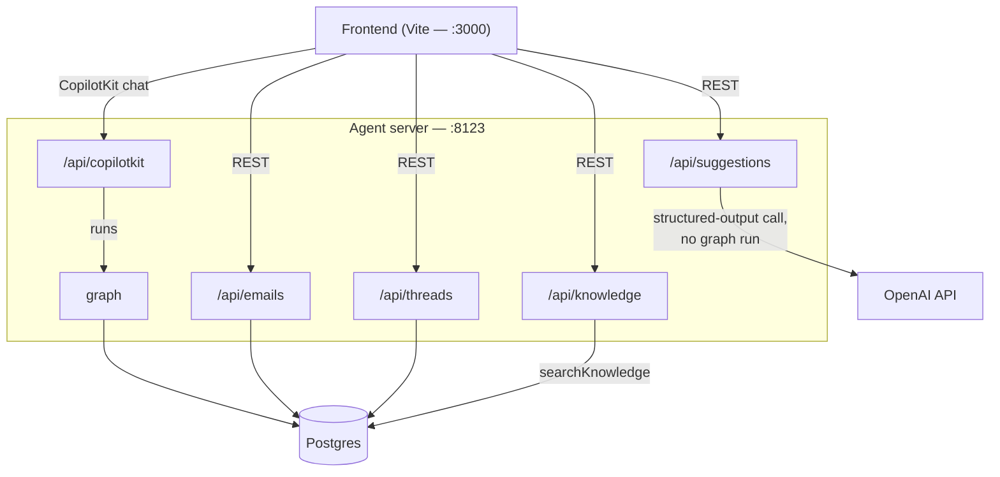

# Agent server (`apps/agent/src/http/index.ts`)

What's inside the "Agent server" box from the [system overview](./system-overview.md) — the Hono
app mounted onto `langgraphjs dev`, and what each route talks to. `graph` is expanded in
[Main agent graph](./main-agent-graph.md); the tables each route touches are expanded in
[Database](./database.md).

