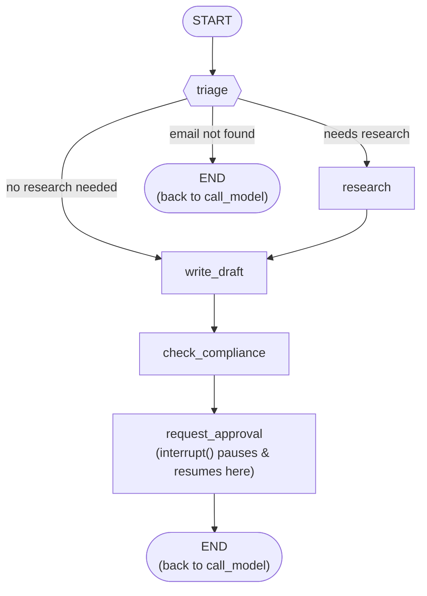

# `compose_email` subgraph (`apps/agent/src/graphs/composeEmailSubgraph.ts`)

```mermaid
graph TD
    START(["START"]) --> triage

    triage{{"triage"}}
    triage -- "needs research" --> research
    triage -- "no research needed" --> write_draft
    triage -- "email not found" --> END_missing(["END\n(back to call_model)"])

    research["research"] --> write_draft
    write_draft["write_draft"] --> check_compliance
    check_compliance["check_compliance"] --> request_approval
    request_approval["request_approval\n(interrupt() pauses & resumes here)"] --> END_interrupt(["END\n(back to call_model)"])
```
