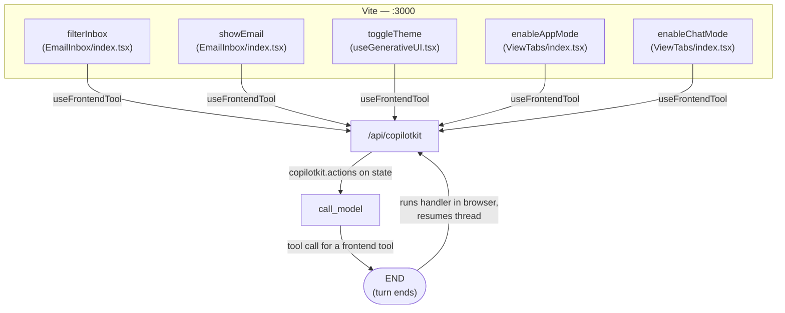

# Frontend tools

```mermaid
graph TD
    subgraph Frontend["Vite — :3000"]
        FilterInbox["filterInbox\n(EmailInbox/index.tsx)"]
        ShowEmail["showEmail\n(EmailInbox/index.tsx)"]
        ToggleTheme["toggleTheme\n(useGenerativeUI.tsx)"]
        EnableAppMode["enableAppMode\n(ViewTabs/index.tsx)"]
        EnableChatMode["enableChatMode\n(ViewTabs/index.tsx)"]
    end

    FilterInbox -- "useFrontendTool" --> CopilotRoute["/api/copilotkit"]
    ShowEmail -- "useFrontendTool" --> CopilotRoute
    ToggleTheme -- "useFrontendTool" --> CopilotRoute
    EnableAppMode -- "useFrontendTool" --> CopilotRoute
    EnableChatMode -- "useFrontendTool" --> CopilotRoute

    CopilotRoute -- "copilotkit.actions on state" --> call_model["call_model"]
    call_model -- "tool call for a frontend tool" --> END(["END\n(turn ends)"])
    END -- "runs handler in browser,\nresumes thread" --> CopilotRoute
```
