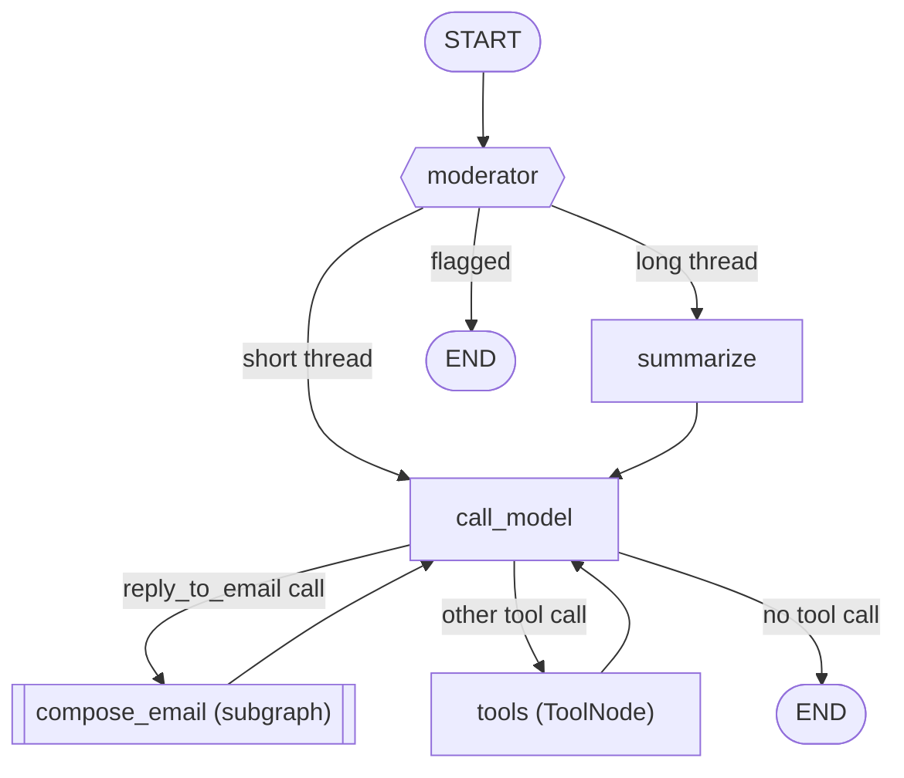

# Main agent graph (`apps/agent/src/graphs/index.ts`)

```mermaid
graph TD
    START(["START"]) --> moderator

    moderator{{"moderator"}}
    moderator -- "short thread" --> call_model
    moderator -- "long thread" --> summarize
    moderator -- "flagged" --> END_blocked(["END"])

    summarize["summarize"]
    summarize --> call_model

    call_model["call_model"]
    call_model -- "reply_to_email call" --> compose_email
    call_model -- "other tool call" --> tools
    call_model -- "no tool call" --> END_done(["END"])

    tools["tools (ToolNode)"]
    tools --> call_model

    compose_email[["compose_email (subgraph)"]]
    compose_email --> call_model
```
