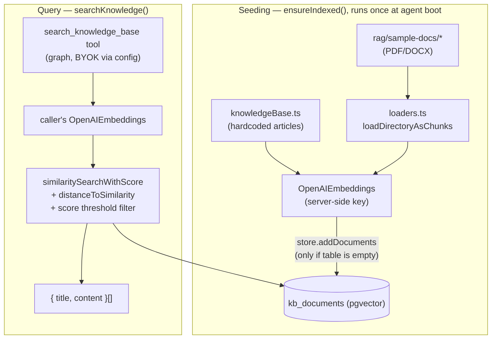

# RAG flow (`apps/agent/src/rag/`)

Two separate flows over the same `kb_documents` pgvector table: seeding it once at startup, and
querying it per request from the `search_knowledge_base` tool (see [Tools](./tools.md)).

