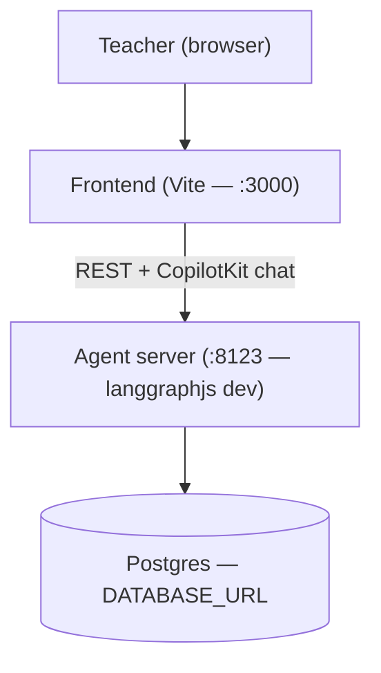

# System overview

For what's inside each box, see [Agent server](./agent-server.md) and
[Database](./database.md).

```mermaid
graph TD
    User["Teacher (browser)"]
    Frontend["Frontend (Vite — :3000)"]
    AgentServer["Agent server (:8123 — langgraphjs dev)"]
    Postgres[("Postgres — DATABASE_URL")]

    User --> Frontend
    Frontend -- "REST + CopilotKit chat" --> AgentServer
    AgentServer --> Postgres
```
