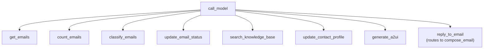

# Tools available to `call_model`

`modelTools` (`apps/agent/src/tools/index.ts`); all but `reply_to_email` run through the `tools`
node — `reply_to_email` is routing-only and never executes.

```mermaid
graph TD
    call_model["call_model"]

    call_model --> get_emails
    call_model --> count_emails
    call_model --> classify_emails
    call_model --> update_email_status
    call_model --> search_knowledge_base
    call_model --> update_contact_profile
    call_model --> generate_a2ui
    call_model --> reply_to_email

    get_emails["get_emails"]
    count_emails["count_emails"]
    classify_emails["classify_emails"]
    update_email_status["update_email_status"]
    search_knowledge_base["search_knowledge_base"]
    update_contact_profile["update_contact_profile"]
    generate_a2ui["generate_a2ui"]
    reply_to_email["reply_to_email\n(routes to compose_email)"]
```
